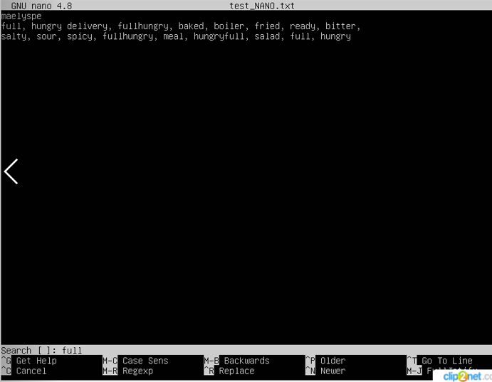
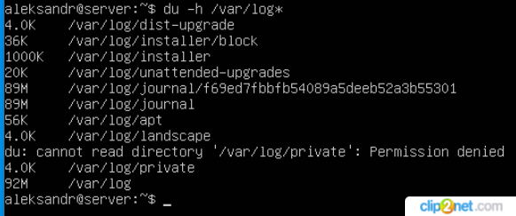
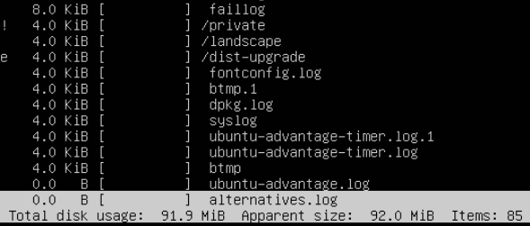
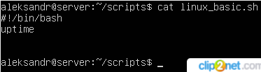

## Часть 1. Установка ОС ##

Установил Ubuntu 20.04 Server LTS без графического интерфейса.

*рис. 1 Установка ОС*

## Часть 2. Создание пользователя ##

Создал ещё одного пользователя Victoria, отличного от пользователя aleksandr, который создавался при установке.
Пользователя  Victoria добавил в группу adm.

*рис. 2 Создание пользователя*
  
## Часть 3. Настройка сети ОС ##

Переименовал машину с aleksandr на user-1, установил временную 24 часовую зону, соответствующую текущему местоположению Asia/Novosibirsk,
вывел названия сетевых интерфейсов с помощью консольной команды.

*рис. 3 Переименование*

На Unix системах интерфейс loopback (lo) - механизм который реализует виртуальный сетевой интерфейс.
Это петлевой интерфейс с IP-адресом 127.0.0.1 обычно используемый для эмуляции передачи данных в пределах данной системы.

Используя консольную команду "hostname -I" получил от DHCP сервера ip адрес устройства, на котором работал.

*рис. 4 IP*

Dynamic Host Configuration Protocol, DHCP (протокол динамической конфигурации узлов) – это сетевой протокол,
используемый для автоматического получения узлами IP-адресов и сетевой конфигурации с сервера.
IP-адрес, выделенный DHCP-клиенту DHCP-сервером, находится в «аренде», время аренды может отличаться в зависимости от того,
сколько времени клиенту требуется соединение или конфигурация DHCP.

Определил (ip route), вывел на экран внешний IP-адрес шлюза (ip) 10.0.2.2 и внутренний IP-адрес шлюза (gw) 10.0.2.15.

*рис. 5 Адреса*

Задал статичные настройки ip, gw, dns, использовал публичные DNS серверы: 1.1.1.1 и 8.8.8.8. После перезагрузки виртуальной машины убедился,
что статичные сетевые настройки (ip, gw, dns) соответствуют ранее заданным.

*рис. 6 Настройки*

Пропинговал удалённые хосты 1.1.1.1 и ya.ru

*рис. 7 Пинг хоста 1.1.1.1*

*рис. 8 Пинг хоста ya.ru*

## Часть 4. Обновление ОС ##

Обновил системные пакеты до последнего на момент выполнения задания.

*рис. 9 Обновление*

## Часть 5. Использование команды sudo ##

**sudo** — это утилита, предоставляющая привилегии суперпользователя (root - он же суперпользователь который имеет
право на выполнение всех операций) для выполнения административных операций в соответствии со своими настройками.
Утилита позволяет легко контролировать доступ к важным приложениям в системе.
Поменял hostname ОС (user-1 на server) от имени пользователя Victoria, созданного ранее (смотри часть 2).

*рис. 10 Права*

## Часть 6. Установка и настройка службы времени ##

Настроил службу автоматической синхронизации времени (проверил так как это сделал это в части 3 при установке соответствующй часовой зоны).

*рис. 11 Время*

## Часть 7. Установка и использование текстовых редакторов ##

Установил текстовые редакторы Vi/Vim, Nano, JOE. Создал три текстовых файла: test_VIM.txt, test_NANO.txt, test_JOE.txt.
Содержание каждого файла: мой никнейм.

Для создания файла test_VIM.txt набрал команду vim, в файл ввёл свой никнейм. Для выхода из редактора и сохранения файла набрал :w test_VIM.txt.

*рис. 12 VIM*

Для создания файла test_NANO.txt набрал команду nano, в файл ввёл свой никнейм. Для выхода из редактора и сохранения файла набрал CTRL +    O далее в появившейся строке набрал test_NANO.txt. Далее Enter, выход из редактора CTRL +    X.

*рис. 13 NANO*

Для создания файла test_JOE.txt набрал команду joe, в файл ввёл свой никнейм. Для выхода из редактора и сохранения файла набрал Ctrl + K,
далее Q и Y ввёл название файла test_JOE.txt.

*рис. 14 JOE*

Открыл файл test_Vim.txt на редактирование (vim test_VIM.txt) отредактировал файл, заменил никнейм на строку "21 School 21",
закрыл файл без сохранения изменений (:q!).

*рис. 15 VIM*

Открыл файл test_NANO.txt на редактирование (nano test_NANO.txt)) отредактировал файл, заменил никнейм на строку "21 School 21",
закрыл файл без сохранения изменений (CTRL + X, далее N).

*рис. 16 NANO*

Открыл файл test_JOE.txt на редактирование (joe test_JOE.txt) отредактировал файл, заменил никнейм на строку "21 School 21",
закрыл файл без сохранения изменений (Ctrl + С, далее N).

*рис. 17 JOE*

Используя редактор Vim добавил в файл слова (отредактировал не сохраняя).
Изучил функцию поиска по содержимому файла (слово целиком).

*рис. 18 VIM поиск*

Изучил функцию замены объектов в файле, осуществил замену старых_объектов на новые_объекты

*рис. 19 VIM замена*

Используя редактор Nano добавил в файл слова (отредактировал не сохраняя).
Изучил комбинацию клавиш поиска по содержимому файла (CTRL + ^ + W).

*рис. 20 NANO поиск*

Изучил комбинация клавиш замены объектов в файле, осуществил замену старых_объектов на новые_объекты
Комбинация клавиш Ctrl + \ далее ввёл строку (что меняем), нажал Enter, далее ввёл строку (на что меняем) нажал Enter,
для замены во всём файле нажал А.

*рис. 21 NANO замена*

Используя редактор Joe добавил в файл слова (отредактировал не сохраняя).
Изучил комбинацию клавиш поиска по содержимому файла (CTRL + K, далее F), объект поиска,
перемещение по файлу при поиске (CTRL + L).

*рис. 22 JOE поиск*

Изучил комбинация клавиш замены объектов в файле, осуществил замену старых_объектов на новые_объекты
Комбинация клавиш (CTRL + K, далее F), далее ввёл строку (что меняем), нажал Enter, далее для замены во всём файле нажал R.
Далее ввёл строку (на что меняем), при подстветке объектов замены в тексте нажимал Y.

*рис. 23 JOE замена*

## Часть 8. Установка и базовая настройка сервиса SSHD ##

* Проверил установлен ли протокол ssh (dpkg -l и ps aux | grep sshd) да протокол был установлен при обновлении системы (смотри часть 4).
* Проверил работу сервера, он должен был добавиться в автозагрузку автоматически проверил (sudo systemctl enable sshd).
* Перенастроил протокол SSHd на порт 2022, отредактировав файл конфигурации (sudo nano /etc/ssh/sshd_config).
* Строку #Port 22 заменил на Port 2022
* Создал новый ключ клиента, (ssh-keygen -t dsa) создал файл, указал пароль для доступа.
* Перезапустил сервер и проверил его корректность работы через открытый и секретный ключ.
* Ввод команды ps предоставит нам информацию о запущенных процессах в текущей оболочке, проверим наличие процесса sshd.

*рис. 24 SSHD*

Команда ps с флагами:
* -с - отобразит информацию планировщика;
* -f - выведет максимум доступных данных;
* -F - аналогично -f, только выводит ещё больше данных;
* -l - длинный формат вывода;
* -j, (j) - выводит процессы в стиле Jobs, минимум информации;
* -M, (Z) - выведет информацию о безопасности;
* -o, (o) - определяем свой формат вывода;
* --sort, (k) - сортируем по указанной колонке;
* -L, (H)- отобразим потоки процессов в колонках LWP и NLWP;
* -m, (m) - выввод потоки после процесса;
* -V, (V) - вывод информацию о версии;
* -H - вывод дерево процессов;

Команда netstat отображает различную информацию, такую как сетевые подключения, статистику интерфейсов, таблицы маршрутизации, и т.п.
* t информация по протоколам TCP;
* a информация о состояние всех сокетов (портов) прослушиваемых и нет;
* n  информация о сетевых адресах показанных в формате числа;
* 0.0.0.0:* это означает, что подключение может быть выполнено на любой внешний адрес

Ввёл команду netstat -tan.

*рис. 25 netstat -tan*

* Proto - протокол  TCP или UDP
* Recv-Q - Счётчик байт не скопированных программой пользователя из этого сокета
* Send-Q - Счётчик байтов, не подтверждённых удалённым узлом
* Local Address - IP -адрес локального компьютера и номер используемого порта
* Foreign Address - IP -адрес и номер порта удалённого компьютера, к которому подключен сокет если есть *, значит порт ещё не установлен
* State - указывает состояние TCP - соединения
 
## Часть 9. Установка и использование утилит top, htop ##

Установил и запустил утилиту top
+ uptime 						            	        		 2:47
+ количество авторизованных пользователей 		        		 3
+ общая загрузку системы						              	 0.0
+ общее количество процессов		    			        	 118
+ загрузка cpu
    * процент времени процессора, затраченного на выполнение пользовательских процессов (us) 0.0
    * процент времени процессора, затраченного на выполнение процессов ядра (sy) 0.2
    * процент времени процессора, затраченного на выполнение пользовательских процессов с ограничениями (ni) 0.0
    * процент времени процессора проведённое в режиме ожидания (id) 99.8
    * процент времени процессора потраченное на ожидание на периферийных устройствах (wa) 0.0 
+ загрузка памяти
    * физическая память (Mem)
        * общий объем ОЗУ (total) 1983.1
        * количество свободной памяти (free) 1332.9
        * количество занятой памяти (used) 173.5
        * зарезервированная системой память (buff/cache) 476.8
    * виртуальная память или пространство подкачки (Swap)
        * общий объем ОЗУ (total) 2048.0
        * количество свободной памяти (free) 2048.0
        * количество занятой памяти (used) 0.0
        * память который может быть выделена для процессов, не использую большую область диска (avail Mem) 1655.1
+ pid процесса занимающего больше всего памяти		        	 1
+ pid процесса, занимающего больше всего процессорного времени	 11

*рис. 26 Утилита top*

Установил и запустил утилиту htop
Отсортировал по PID

*рис. 27 Утилита htop*

Отсортировал по PERCENT_CPU

*рис. 28 Сортировка по PERCENT_CPU*

Отсортировал по PERCENT_MEM

*рис. 29 Сортировка по PERCENT_MEM*

Отсортировал по TIME

*рис. 30 Сортировка по TIME*

Отфильтровавал по процессу sshd

*рис. 31 Сортировка по процессу sshd*

Нашёл процессы с syslog

*рис. 32 (а) Поиск*

*рис. 32 (б) Поиск + Фильтрование*

Вывел процессы с добавлением hostname, clock и uptime

*рис. 33 Процессы с добавлением hostname, clock и uptime*

## Часть 10. Использование утилиты fdisk ##

Команда fdisk -l вывела информацию о доступных мне дисках и разделах на них 
Описание диска:
* название жёсткого диска sda (sd блочное устройство как правило SCSI, a - найдено первым);
* его размер 30 GiB;
* количество секторов на диске 62914560;
* размер swap 2.0 GiB

*рис. 34 Утилита fdisk*

## Часть 11. Использование утилиты df ##

Запустил команду df.

Для корневого раздела (/) (/dev/mapper/ubuntu--vg-ubuntu-lv):
* размер раздела 14380040 KiB
* размер занятого пространства 4760392 KiB
* размер свободного пространства 8869468 KiB
* процент использования 35%

*рис. 35 Утилита df*

Запустил команду df -Th.

Для корневого раздела (/) (/dev/mapper/ubuntu--vg-ubuntu-lv):
* размер раздела 14 GiB
* размер занятого пространства 4.6 GiB
* размер свободного пространства 8.5 GiB
* процент использования 35%

*рис. 36 Утилита df -Th*

## Часть 12. Использование утилиты du ##

Запустил команду du

Вывел размер содержимого папок home, log (в байтах, в человекочитаемом виде)

*рис. 37 Содержимое папок home, log*

Вывел размер содержимого папки var (в байтах, в человекочитаемом виде)

*рис. 38 Содержимое папки var*

Вывел размер содержимого в var/log (не всего, а каждого вложенного элемента, используя *)

*рис. 39 Содержимого в /var/log**

## Часть 13. Установка и использование утилиты ncdu ##

Установил утилиту ncdu (sudo apt install ncdu).

Вывел размер папки home.

*рис. 40 Папка home*

Вывел размер папки  var.

*рис. 41 Папка var*

Вывел размер и содержимое папки  /var/log.

*рис. 42 - 43 Папка log*

## Часть 14. Работа с системными журналами ##

В папке log просмотрел файлы: dmesg, syslog, auth.log
* Время последней успешной авторизации - 18:09:08
* Имя пользователя - aleksandr
* Метод входа в систему - для входа использовалось sshd соединение, аутентификации в режиме pam_unix (проверялось действительность пользователя по предоставленному паролю. Информацию о пароле пользователя система ищет в соответствии с алгоритмом, заданным в конфигурационном файле).

*рис. 44 Данные о пользователе*

Перезапустил службу SSHd. Просмотрел сообщение в логах о рестарте службы.

*рис. 45 Рестарт службы SSHd*

## Часть 15. Использование планировщика заданий CRON ##

Написал скрипт, в планировщике заданий создал добавил задание с написанным скриптом, (запуск uptime через каждые 2 минуты).

*рис. 46 Запуск команды uptime*

*рис. 47 Скрипт*

Список текущих заданий для CRON

*рис. 48 Список текущих заданий*

Удалил задание из планировщика заданий (изменил файл, другой способ crontab -r).

*рис. 49 Удаление*

*рис. 50 Содержимое файла*
